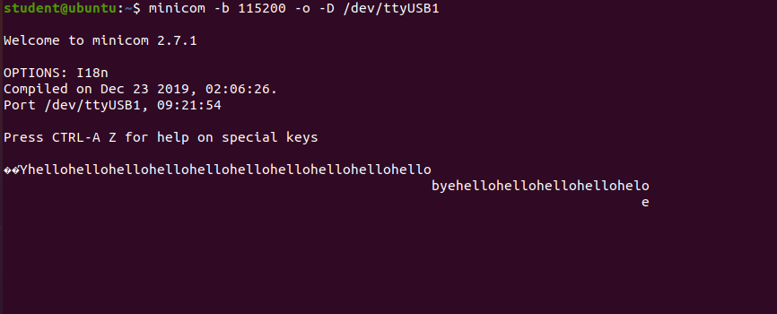
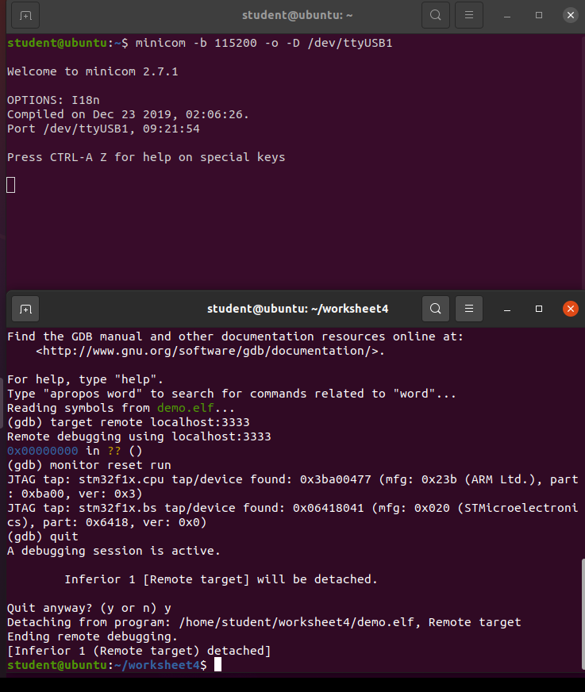
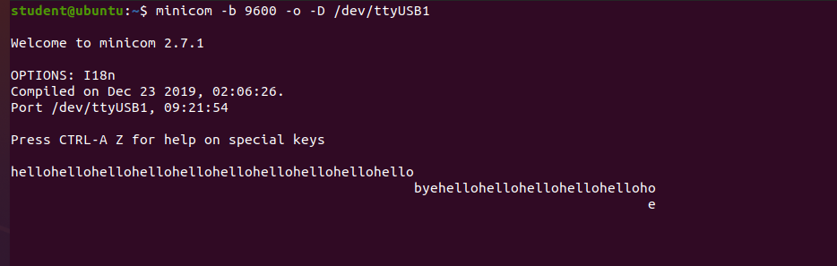
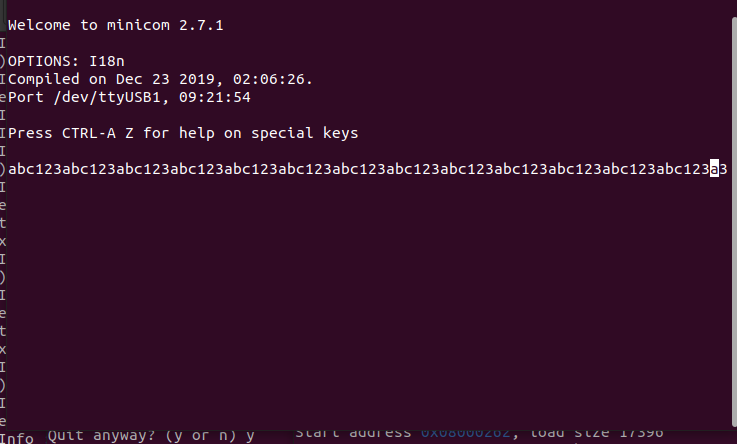
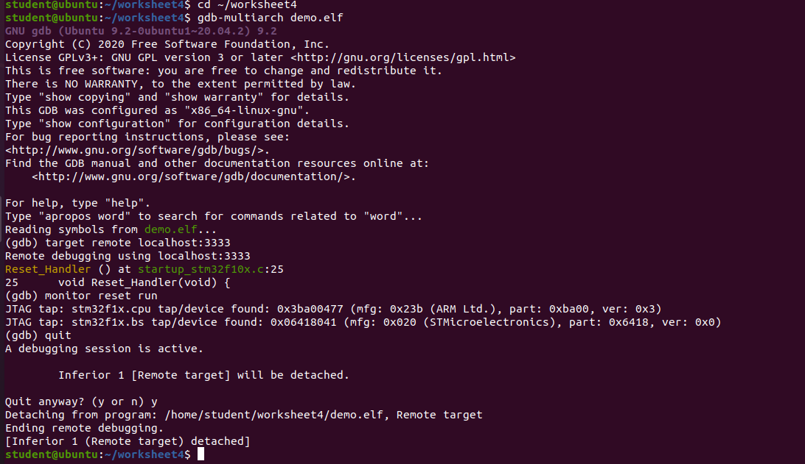

# Secure Embedded Systems - Worksheet 4

## Title
Serial Data Communication

## Student
Sanjana

## Overview
This worksheet focused on serial communication using the STM32 Olimex board. USART communication was configured to transmit and receive data between the STM32 board and a PC terminal.

---

# Tasks Completed

## Exercise 1 - Send Text from STM32 to PC Terminal

The STM32 board was programmed to transmit text through USART to the PC terminal using Minicom.

### Screenshot

---

## Exercise 2 - Change Baud Rate

The baud rate was changed from **115200** to **9600**.

### Incorrect Baud Rate (115200)

Communication did not display correctly when terminal baud rate did not match the board.

### Correct Baud Rate (9600)

Communication worked correctly when both sides used 9600 baud.

---

## Exercise 3 - Receive Keyboard Input

A receive function was implemented using USART. Characters typed in Minicom were received by the STM32 board and echoed back to the terminal.

### Screenshot

---

## Programming / Flashing the Board

The board was programmed successfully using OpenOCD and GDB.

### Screenshot

---

# Software Used

- Ubuntu Virtual Machine
- OpenOCD
- GDB Multiarch
- Minicom

# Hardware Used

- Olimex STM32 Board
- JTAG Debugger
- USB Serial Adapter

# Conclusion

USART serial communication was successfully implemented. Data transmission, baud rate configuration, and keyboard input reception were tested successfully.
